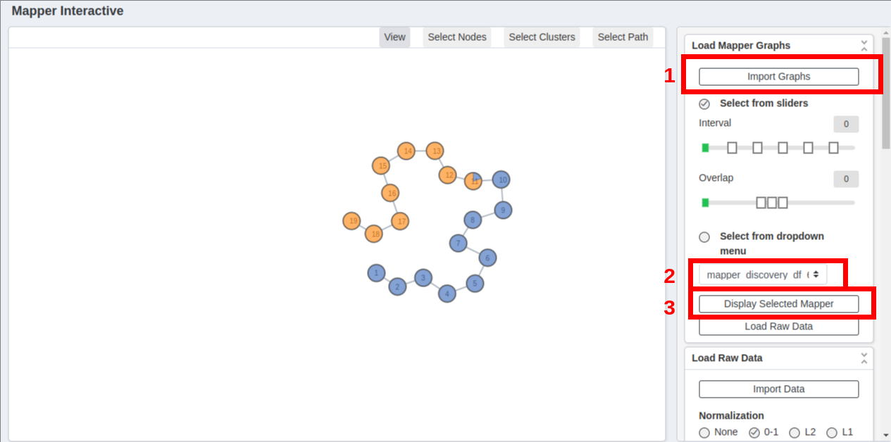

# Brain Mapper


This repository contains code for spectrum analysis of ADHD and ASD disorders using Mapper Algorithm.


## Getting Started


### Prerequisites

- Python >= 3.8
- Bash (for running `generator.sh`)
- Recommended: Create a virtual environment using `venv`

Install dependencies:

```bash
pip install -r requirements.txt
```


## Running the pipeline

Run each step sequentially:

### Preprocess data
```bash
python3 preprocess.py
```
- This script performs the following:
  
  - **Loads raw static functional connectivity (SFC) matrices** from `.mat` files for Autism, Asperger, and ADHD subtypes.

  - **Aligns ROI indices to a common 190-ROI standard** using a provided Excel mapping file, ensuring all datasets have consistent spatial references for further analysis.


### Split dataset
```bash
python3 split_dataset.py
```
This script splits the dataset into discovery set and replication set.

### Evaluate parameters
```bash
python3 evaluate_parameters.py
```
This script generates plots of DBSCAN epsilon and projection functions to guide the parameter selection.

### Generate mapper graphs

After reviewing the plots generated by `evaluate_parameters.py`, choose the DBSCAN epsilon, minPTS, and projection function that show optimal clustering performance and run the generator script with your selected parameters:

```bash
bash generator.sh
```


### Run mapper interactive GUI
```bash
cd MapperInteractive
python3 run.py
```
This step launches the interactive Mapper visualization tool. In the GUI:
1. Load the generated graphs directory in `MapperInteractive/app/static/uploads`.
2. Choose the graph you want to inspect.
3. Display and explore the graph interactively.



### Extract transition features
```bash
python3 transition_features.py
```
